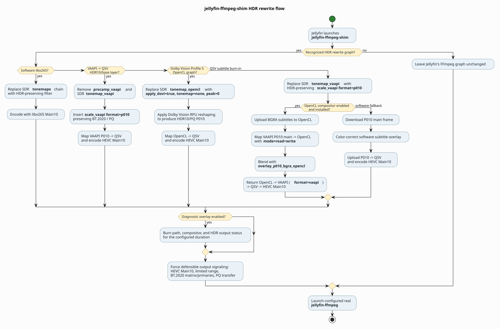

# jellyfin-ffmpeg HDR shim

`jellyfin-ffmpeg-shim` is a jellyfin-ffmpeg wrapper that lets you transcode HDR
video WITHOUT tone-mapping it to SDR.  Keep that beautiful HDR goodness even
when your bandwidth is not quite there.

It was developed and tested against Jellyfin 10.11.11 on my Intel UHD Graphics
630 (Comet Lake GT2), using the Intel `iHD` VAAPI driver, Intel OpenCL, and QSV
HEVC Main10 encoding.  Playback was tested with Jellyfin Android TV 0.19.9 and
Jellyfin Web 10.11.11.  It may work with other Jellyfin versions and Intel
systems, but they are untested.  It will not currently perform HDR rewrites
with NVIDIA, AMD, or other hardware backends.

The purpose of this project is the following:

1. To enable a feature on my own setup that I have wanted for years.
2. To demonstrate that this is not especially difficult, and that Jellyfin
   should seriously consider supporting it directly.  This project was vibe
   coded with Codex in just a few hours.
3. Hopefully, to encourage other developers to add support for more hardware.
   General development experience is really all you need.  I know very little
   about FFmpeg filter graphs myself.  Spin up Codex and get to work.  If we
   can document the FFmpeg filter graphs and hardware pipelines required for
   each platform, it may make it easier for Jellyfin to implement this
   upstream.

This project is an experimental proof of concept.  It is implemented as a shim
so the functionality can be dropped into an existing installation without
requiring an experimental, hardware-specific fork of Jellyfin itself.  It is
not feature-complete and does not support every HDR format or hardware
pipeline.  YMMV.

## What it does

The shim replaces Jellyfin's SDR tone-mapping with HDR-preserving transcoding
when the source, client, and FFmpeg command match a supported path.  HDR stays
HDR even when Jellyfin must change the resolution, bitrate, codec settings, or
burn subtitles into the video.

It currently handles these cases:

- Preserve ordinary HDR10 while transcoding.
- Preserve the compatible HDR10 base layer from supported Dolby Vision Profile
  7 and Profile 8 sources.
- Convert Dolby Vision Profile 5 to HDR10 with OpenCL.  More precisely, this
  applies the Dolby Vision RPU reshaping data to recover the intended HDR image
  and writes it as standard HDR10/PQ.  This is not SDR tone-mapping: the result
  remains HDR and is not compressed to an arbitrary SDR brightness target.
- Burn subtitles into HDR video with the custom
  `overlay_p010_bgra_opencl` filter.  The filter converts ordinary SDR subtitle
  colors into appropriate BT.2020/PQ values and composites them directly on
  the GPU.  If the custom filter is unavailable, the shim retains a slower
  color-correct software fallback.
- Prevent unusually low bitrates in dark scenes.  Jellyfin can select a very
  low instantaneous bitrate for dark material, so the shim adds `-minrate`.
  By default it is 70% of Jellyfin's `-maxrate`; the ratio is configurable.

Before changing an HDR command, the shim can pull Jellyfin's active sessions,
identify the username and device, compare them with case-insensitive allow and
deny rules, and probe the source with `ffprobe`.  It logs the session decision,
source-probe result, original command, rewrite, and reason for any passthrough.

Commands that do not match a known-safe shape are passed through unchanged.
The shim does not replace Jellyfin's playback negotiation or independently
select a GPU.

## How a launch works

```text
Jellyfin
  -> jellyfin-ffmpeg-shim
     -> load and validate /etc/jellyfin/shim.json
     -> classify Jellyfin's FFmpeg command
     -> pull active sessions from Jellyfin when client filtering is enabled
     -> identify the username and device for the transcode
     -> check case-insensitive deny and allow rules (deny wins)
     -> probe the source video with ffprobe
     -> apply an allowed, recognized rewrite or leave the command unchanged
     -> log the client, source, backend, and rewrite decisions
     -> exec the configured real FFmpeg binary
```

The final step uses process replacement, so FFmpeg remains the process that
Jellyfin monitors and controls.

The complete rewrite and FFmpeg hardware flow is shown in the
[decision-flow diagram](docs/ffmpeg-flow.svg).  Its editable PlantUML source
and build script are in `docs/`.

## Supported hardware and formats

The implemented hardware paths were developed and tested against Jellyfin
10.11.11 and the pipeline it emitted on the development system: Intel UHD
Graphics 630, Intel `iHD`, VAAPI decode/filtering, Intel OpenCL, and QSV Main10
encoding.  Playback was exercised through Jellyfin Android TV 0.19.9 and
Jellyfin Web 10.11.11.  The code does not hardcode that model, render node, PCI
ID, or GPU generation, but that does not mean other Intel hardware or Jellyfin
versions have been tested.  The shim recognizes command shape and
capabilities; its accelerated behavior has only been tested on the hardware
and software stack above.

Implemented source behavior includes:

- HDR10 preservation.
- Dolby Vision Profile 7/8 with a verified HDR10-compatible base layer.
- Dolby Vision Profile 5 to HDR10 for the recognized VAAPI/OpenCL/QSV graph.
- HDR subtitle burn-in using the custom P010/BGRA OpenCL compositor.

AMD, NVIDIA, native VAAPI encode, Vulkan Video, and VideoToolbox are detected
but intentionally not rewritten.  They pass through to Jellyfin's original
behavior.  Porting notes are maintained in `.agentic/handoff.md`.

## Requirements

- Linux with Python 3.
- Jellyfin and a working jellyfin-ffmpeg installation.
- `ffprobe` from the same jellyfin-ffmpeg build.
- A Jellyfin API key only when `enable_client_allow_deny` is `true`.
- For accelerated HDR subtitle composition: a jellyfin-ffmpeg build containing
  `overlay_p010_bgra_opencl`.

The jellyfin-ffmpeg 8.1.2 source developed and tested with Jellyfin 10.11.11,
including the custom OpenCL compositor, is maintained at
[bjlaur/jellyfin-ffmpeg](https://github.com/bjlaur/jellyfin-ffmpeg).

The custom compositor is optional.  When it is absent, supported subtitle
rewrites use the software compositor fallback.

## Arch Linux installation

Build and install the package from this repository:

```bash
makepkg -si
```

The package installs:

```text
/usr/local/bin/jellyfin-ffmpeg-shim
/etc/jellyfin/shim.json
```

The configuration file is treated as a package backup file, so local changes
are preserved across upgrades according to normal `pacman` behavior.

## Manual installation on other distributions

Install the executable and example configuration:

```bash
sudo install -Dm755 jellyfin-ffmpeg-shim \
  /usr/local/bin/jellyfin-ffmpeg-shim

sudo install -Dm640 shim.json.example \
  /etc/jellyfin/shim.json
```

If the Jellyfin group exists, allow Jellyfin to read the configuration:

```bash
sudo chown root:jellyfin /etc/jellyfin/shim.json
sudo chmod 0640 /etc/jellyfin/shim.json
```

Adjust the user and group if your distribution runs Jellyfin under different
credentials.  Also update the real FFmpeg and ffprobe paths in `shim.json` if
your distribution does not install them under `/usr/lib/jellyfin-ffmpeg/`.

No Python packages are required outside the standard library.

## Configuration

Edit `/etc/jellyfin/shim.json`.  The complete example is in
`shim.json.example`.

If client filtering is enabled, create an API key in Jellyfin's administration
dashboard and set:

```json
"jellyfin": {
  "url": "http://127.0.0.1:8096",
  "api_key": "YOUR_API_KEY"
}
```

The API key is required only when `enable_client_allow_deny` is `true`.
If client filtering is enabled and the key is empty or missing, the shim
enables its kill switch and performs total passthrough.  Set
`enable_client_allow_deny` to `false` to skip the Jellyfin API lookup and
allow every client to use otherwise-safe HDR rewrites; the allow and deny lists
are ignored in that mode.  Invalid JSON or other invalid required settings
still activate the kill switch.

Configure client access under `hdr_access`:

```json
"hdr_access": {
  "allow_list": [
    {
      "username": "alex",
      "devices": ["living room chrome", "television"]
    }
  ],
  "deny_list": [
    {
      "username": "alex",
      "devices": ["firefox"]
    },
    {
      "username": "guest"
    }
  ]
}
```

User and device comparisons are case-insensitive.  A rule without `devices`
matches every device for that user.  Deny rules take precedence over allow
rules.

Important configuration controls:

- `kill_switch`: disables every rewrite and API decision.
- `enable_hdr_to_hdr`: enables supported HDR-preserving rewrites.
- `enable_bitrate_min`: enables the configured minimum bitrate ratio.
- `enable_client_allow_deny`: enables synchronous Jellyfin session
  lookup and allow/deny filtering.  When disabled, no API key is required and
  otherwise-safe HDR rewrites are allowed for every client.
- `enable_filter_complex_hdr_to_hdr`: enables supported subtitle/filter-complex
  rewrites.
- `enable_opencl_subtitle_compositor`: uses the custom GPU subtitle compositor
  when available.  Set it to `false` to force the slower software subtitle
  fallback without disabling HDR subtitle burn-in entirely.
- `enable_diagnostic_overlay`: burns a 15-second status panel into supported
  HDR rewrites.  It is disabled by default and is intended for confirming the
  active playback path without opening the shim log.
- `log_full_argv`: logs full original and rewritten commands; these can contain
  media paths.
- `minrate_ratio`: fraction of `-maxrate` used for `-minrate`.
- `diagnostic_overlay_duration_seconds`: how long the optional diagnostic panel
  remains visible, from 0.1 to 300 seconds.

To use a different configuration file, set `JELLYFIN_SHIM_CONFIG` in the
Jellyfin service environment:

```text
JELLYFIN_SHIM_CONFIG=/path/to/shim.json
```

The `paths.ffmpeg_binary` setting must point to the real FFmpeg binary, not the
shim.  Pointing it back to the shim would create recursive execution.

## Activate the shim in Jellyfin

Before activation, validate the configuration as the Jellyfin service user:

```bash
sudo -u jellyfin /usr/local/bin/jellyfin-ffmpeg-shim --check-config
```

Confirm that `kill_switch` is `0`, the configured paths are correct, and there
is no `config_load_error`.

Then configure Jellyfin's FFmpeg path as:

```text
/usr/local/bin/jellyfin-ffmpeg-shim
```

Depending on the Jellyfin package, this setting may be in the administration
dashboard or the service environment.  Check `/etc/jellyfin/jellyfin.env` on
distributions that provide it.  Restart Jellyfin after changing the path:

```bash
sudo systemctl restart jellyfin
```

To deactivate the shim immediately, restore Jellyfin's FFmpeg path to the real
binary.  Setting `kill_switch` to `true` provides passthrough without changing
Jellyfin's configured path.

## Verification

Check whether the installed FFmpeg contains the accelerated subtitle filter:

```bash
/usr/lib/jellyfin-ffmpeg/ffmpeg -hide_banner -filters \
  | grep overlay_p010_bgra_opencl
```

Start a known HDR transcode from an allowed client and inspect:

```text
/var/log/jellyfin/jellyfin-ffmpeg-shim.log
```

The log records the client decision, source probe, selected backend, rewrite
decision, and final FFmpeg command.  Jellyfin's own FFmpeg log remains the
place to diagnose decoder, filter, mapping, and encoder failures.

For HDR output, verify that the resulting stream is HEVC Main10 with limited
range, BT.2020 primaries/matrix, and SMPTE ST 2084/PQ transfer signaling.

## Safety behavior

The shim is deliberately fail-closed with respect to rewrites:

- Missing or invalid configuration activates total passthrough.
- Missing API key activates total passthrough only when client filtering is
  enabled.
- No confident active-session match denies the HDR rewrite.
- Unsupported source profiles and filter graphs are left unchanged.
- Unsupported hardware backends are left unchanged.
- Source probing occurs before risky HDR changes.

“Unchanged” means Jellyfin's original FFmpeg command runs.  It does not mean
playback is rejected; Jellyfin may still perform its original SDR tone map.

## Known limitations

- **Playback must be started twice.** Start the video once, go back, and then
  start it again.  Jellyfin does not publish the active playback session before
  it launches FFmpeg, but the shim needs that session to identify the user and
  device before it can launch the real FFmpeg.  On the second attempt, the
  session exists and the shim can apply the allow/deny rules.  Fixing this
  properly would require changes inside Jellyfin; this is the best that can be
  done from an external FFmpeg shim.
- Accelerated rewrites currently support only the recognized Intel graph
  shapes.
- If the custom OpenCL filter exists but fails after FFmpeg starts, the shim
  cannot restart FFmpeg automatically with the software fallback.
- Client rules describe access, not detailed display capabilities such as
  supported Dolby Vision profiles.
- Unsupported HDR10+, HLG, Dolby Vision, and unusual filter combinations pass
  through rather than being converted by the shim.
- Dolby Vision dynamic metadata is not retained in HDR10 output.
- Full-argument logging can disclose local filenames and directory layouts.

## Development

If you are experimenting with a new hardware backend, start with the
[developer getting-started workflow](how-to-get-started.md).

Run the regression tests with:

```bash
python3 -m unittest -v tests/test_hardware_backends.py
python3 -m py_compile jellyfin-ffmpeg-shim
```

The project handoff and implementation history are documented in
`.agentic/handoff.md`.

### FFmpeg rewrite flow

The diagram summarizes the recognized command graphs, substitutions made by
the shim, and the common launch path.



### OpenCL P010/BGRA subtitle compositor

The stock hardware subtitle path available during development could not blend
Jellyfin's BGRA subtitle surface correctly into a P010 HDR main surface.  The
VAAPI attempt produced incorrectly colored subtitles, while the reliable
software path required downloading every P010 video frame to system memory,
compositing on the CPU, and uploading it again.  That transfer made subtitle
burn-in substantially slower than the otherwise hardware-accelerated pipeline.

To avoid that round trip, the jellyfin-ffmpeg fork adds the two-input
`overlay_p010_bgra_opencl` filter.  It accepts:

- an OpenCL hardware frame whose software format is P010 for the HDR video;
- an OpenCL hardware frame whose software format is BGRA for the subtitle
  image; and
- straight or premultiplied subtitle alpha.

The OpenCL kernel treats the subtitle image as sRGB/BT.709 graphics.  It
linearizes the RGB values, converts the primaries from Rec.709 to Rec.2020,
maps subtitle white to `subtitle_peak` nits, applies the ST 2084/PQ transfer
function, and converts the result to limited-range BT.2020 non-constant
luminance YCbCr.  The shim currently supplies `subtitle_peak=203` and
`alpha_mode=straight`.

Each OpenCL work item handles one 2x2 P010 luma block.  Luma is alpha-blended
per pixel.  The four subtitle samples are alpha-weighted to produce the single
4:2:0 chroma sample for that block, avoiding a separate chroma resampling pass.
Pixels outside the subtitle rectangle, and frames for which framesync has no
subtitle overlay, preserve the original video.

The critical implementation constraint is surface ownership.  Allocating a
new OpenCL output frame produced a device-only surface that could not be mapped
back into the VAAPI/QSV pipeline on the Intel stack developed and tested
against Jellyfin 10.11.11.  The filter instead clones the mapped main frame,
retains its hardware-frame context, and composites onto that mapped surface.
The shim therefore requests read/write access in both mapping directions:

```text
VAAPI P010
  -> hwmap=derive_device=opencl:mode=read+write
  -> overlay_p010_bgra_opencl
  -> hwmap=derive_device=vaapi:mode=read+write,format=vaapi
  -> hwmap=derive_device=qsv,format=qsv
  -> QSV HEVC Main10
```

The explicit `format=vaapi` is significant.  It restores the frame type before
deriving the QSV view; omitting it caused the reverse map to fail with
`Function not implemented`.  The subtitle branch is independently scaled to
the output dimensions as BGRA and uploaded directly to the OpenCL device.

When the diagnostic overlay is enabled, `color` and `drawtext` create a shallow
BGRA status panel for the configured duration.  Hardware rewrites upload only
that panel to OpenCL and blend it with `overlay_p010_bgra_opencl` before the
frame returns to VAAPI/QSV.  Text rendering occurs in software, but the P010
video is never downloaded; only the diagnostic panel crosses from system
memory to the GPU.  The panel reports the successful rewrite, active path, and
HDR output signaling.

For ordinary HDR10 and Dolby Vision Profile 5 rewrites, the shim promotes
Jellyfin's simple video filter into a two-branch complex graph.  The rewritten
P010 video remains in OpenCL on one branch while the small diagnostic panel is
rendered and uploaded on the other.  The compositor output maps back through
VAAPI to QSV Main10.  Subtitle burn-in uses the same idea but adds the panel as
a second compositor pass after the subtitle pass.  Software libx265 rewrites
use `drawtext` directly because those video frames already reside in system
memory.

The shim uses this path only when it recognizes the exact three-branch QSV
subtitle graph and the configured jellyfin-ffmpeg binary advertises the custom
filter.  It replaces Jellyfin's SDR `tonemap_vaapi` stage with HDR-preserving
P010 scaling, preserves relevant overlay timing options, removes dimensions
that belong to `overlay_qsv`, and substitutes the OpenCL compositor.  An
unrecognized graph is not modified.  If the filter is missing or disabled,
the shim uses the color-correct software compositor instead.

This implementation is not intrinsically a QSV compositor—the color conversion
and blend operate on OpenCL images—but its proven zero-copy interoperation is
specific to the VAAPI-to-OpenCL-to-VAAPI-to-QSV frame path.  AMD, NVIDIA, and
other backends need their own demonstrated surface import/export and
synchronization path before the shim can safely use this filter with them.
